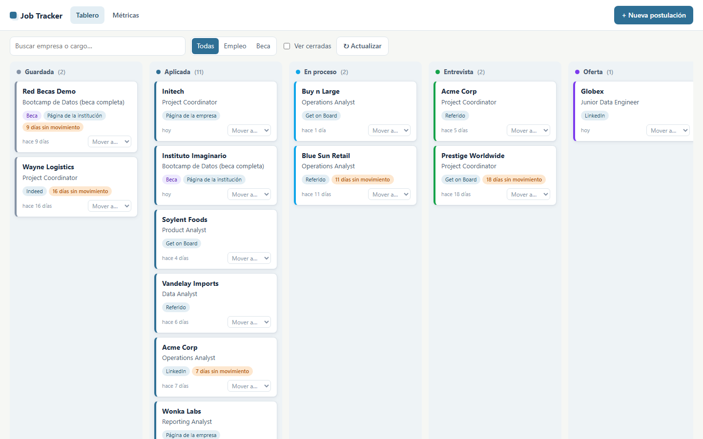
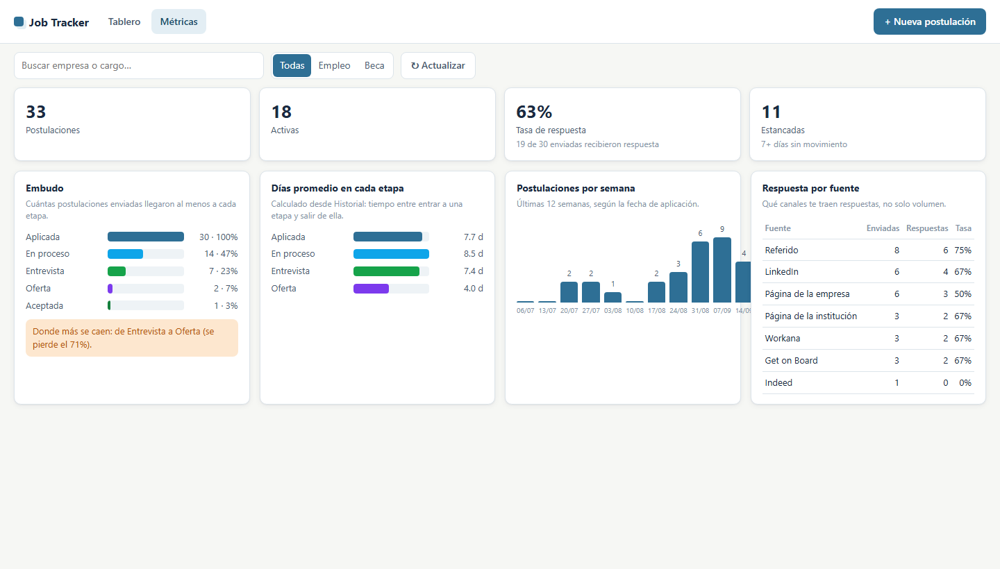

# Job Search Copilot · Plantilla gratuita

**Un tablero para organizar tu búsqueda de empleo o de becas, dentro de Google Sheets.** Gratis, sin programar y sin necesidad de usar inteligencia artificial.

Lo construí para mi propia búsqueda de trabajo remoto. Ya conseguí trabajo, así que lo convertí en una plantilla para que tú también lo uses.

[**Hacer mi copia**](SHEET_COPY_LINK) · [**Guía paso a paso**](sheets-template/SETUP_GUIDE.es.md) · [Ver demo](https://DEMO_URL) · [English](README.md)

## Qué hace

- **Tablero kanban:** una columna por etapa (Guardada, Aplicada, En proceso, Entrevista, Oferta…). Arrastras la tarjeta y listo.
- **Empleos y becas** en el mismo lugar, con filtro.
- **Historial automático:** cada cambio de etapa queda registrado con fecha, y puedes agregar notas (por ejemplo, qué te preguntaron en la entrevista).
- **Alertas de seguimiento:** marca en naranja lo que lleva 7 días (o los que elijas) sin moverse. Opcional: te llega un correo, uno solo por postulación.
- **Métricas que sirven para decidir:**
  - Tasa de respuesta real (sin contar las que solo guardaste o retiraste).
  - En qué etapa se caen más procesos.
  - Cuántos días pasan en cada etapa.
  - Postulaciones por semana.
  - Qué fuente te trae más respuestas (LinkedIn, referidos, páginas de empresas…).
- **Evita duplicados:** te avisa si ya registraste esa vacante (mismo link o misma empresa y cargo).
- **IA opcional:** un botón copia un prompt con los datos de la postulación, listo para pegar en ChatGPT, Gemini o Claude. Incluye reglas para que la IA **no invente experiencia** en tu CV.

## Cómo empezar (5 minutos)

1. Abre el link de copia y pulsa **Hacer una copia**.
2. Menú **Job Tracker → Configurar por primera vez** y acepta los permisos (la guía explica la pantalla de "app no verificada").
3. Menú **Job Tracker → Abrir tablero**.

Guía completa con capturas: [SETUP_GUIDE.es.md](sheets-template/SETUP_GUIDE.es.md).

## Prompts para cualquier IA

Si usas ChatGPT, Gemini o Claude, estos prompts te ayudan sin inventar nada:

- [Analizar una vacante](ai-prompts/analizar-vacante.md): % de match, fortalezas, brechas y recomendación.
- [Adaptar tu CV sin inventar](ai-prompts/adaptar-cv-sin-inventar.md): te muestra cada cambio y de dónde sale.
- [Preparar una entrevista](ai-prompts/preparar-entrevista.md): preguntas probables y respuestas con tus ejemplos reales.

## Privacidad

Tu copia vive en **tu** Google Drive. El script no envía datos a ningún servidor: todo el código está a la vista en **Extensiones → Apps Script**.

## Licencia

[MIT](LICENSE): úsala, modifícala y compártela.
