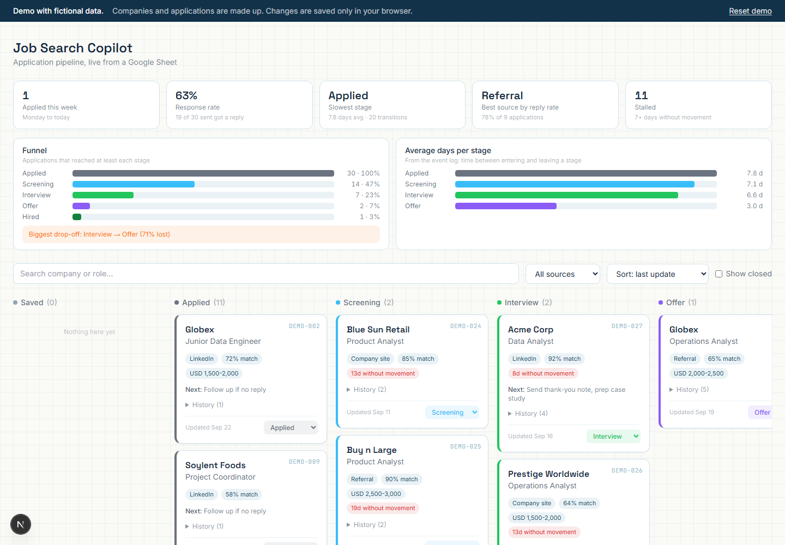
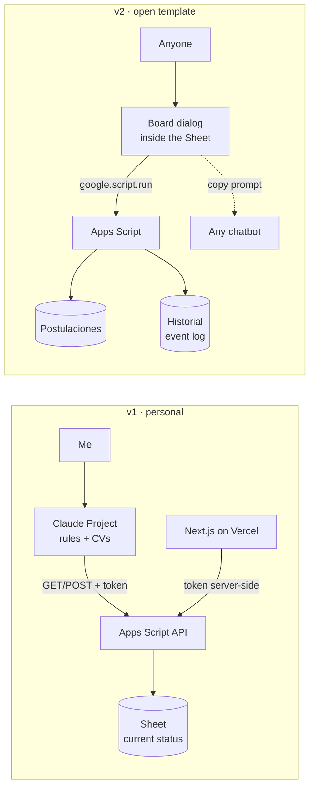

# Job Search Copilot

**A job-search tracker I built for my own remote job search, rebuilt as a free Google Sheets template anyone can use.** Kanban board, an event log, funnel metrics and stall alerts, with optional AI prompts that work in any chatbot.

[**Live demo**](https://DEMO_URL) (fictional data) · [**Get the template**](sheets-template/SETUP_GUIDE.md) · [Versión en español](README.es.md)



---

## The problem

A remote job search means dozens of applications running in parallel, each at a different stage, with a different CV version and a different follow-up date. Three things kept going wrong:

1. **Losing track.** Which applications have gone quiet, and when should I follow up?
2. **Tailoring CVs without exaggerating.** AI tools happily "optimize" a CV by adding experience you do not have.
3. **Not knowing what works.** Which sources get replies? Where do processes die?

## What I built

**v1: a personal copilot** (used during my own search)

- A **Claude Project** with strict truthfulness rules: analyze a vacancy (`MATCH / WHY / GAPS / RECOMMENDATION`), adapt a CV without inventing anything, prepare for a specific interview.
- A **Google Sheet as the tracker**, exposed through an **Apps Script API** (query, create, update, list) so the assistant could log applications from chat.
- A **Next.js dashboard on Vercel**: kanban, metrics, password login, and API routes that keep the Apps Script token on the server.

**v2: an open template** (this repo's main product)

- A **Google Sheet with a built-in board**: make a copy, click one menu, done. No token, no deployment, no AI required.
- An **event log** (`Historial`) behind every metric.
- An optional **"Copy AI prompt"** button that works with ChatGPT, Gemini or Claude, with no API keys.
- The **Next.js dashboard in demo mode** as a technical showcase.

## Architecture



More detail: [docs/architecture.md](docs/architecture.md).

## Key decisions

| Decision | Why |
|---|---|
| **The Sheet is the single source of truth** | The assistant's memory is not a database. It queries the Sheet before every write, so no duplicates across chats, and users can fix anything by editing a cell. |
| **Token only on the server** | The dashboard's API routes proxy Apps Script; the browser gets an HMAC-signed cookie, never the token. The v2 template removes the token entirely. |
| **Verify before retrying** | Apps Script web apps reply with a 302 redirect, and a write can succeed even when the client sees an error. Re-query before retrying; the server assigns IDs. |
| **Truthfulness over ATS scores** | Hard rules: never invent experience, tools, dates or metrics; list gaps instead of hiding them; verify the adapted CV against the source. |

All eight decisions, ADR style: [docs/decisions.md](docs/decisions.md).

## Results

<!-- TODO(Carlos): replace with real numbers from the tracker. Do not estimate. -->
During my search I tracked **[N] applications**: **[N]** got a reply, **[N]** reached an interview, and **1 ended in an offer I accepted**.

## What I'd do differently

**Model an event log from day one.** v1 stored only each application's *current* status and a "last update" date. It worked for the daily view, but as soon as I asked analytical questions (how long do applications sit in screening? at which stage do most processes die?) the answer was "unknowable": every stage change overwrote the previous one. The v1 dashboard even reported a "response rate" that counted `Saved` and `Withdrawn` as replies.

v2 fixes this with an append-only `Historial` table (`timestamp, id, from, to, note`). Current state stays as a readable row; every time-based metric comes from events. Metric definitions are written down in [docs/metrics.md](docs/metrics.md) and covered by unit tests, including the exact case that exposed the v1 bug.

Other lessons (idempotent side effects, deduplicating on a stable key, removing setup steps for non-technical users): [docs/lessons-learned.md](docs/lessons-learned.md).

## Try it

- **Live demo:** [DEMO_URL](https://DEMO_URL). Fictional companies; your changes stay in your browser.
- **Template:** [make a copy](SHEET_COPY_LINK) and follow the [setup guide](sheets-template/SETUP_GUIDE.md) ([español](sheets-template/SETUP_GUIDE.es.md)).
- **AI prompts:** [ai-prompts/](ai-prompts/) (Spanish) and the [generic system prompt](original-copilot/system_prompt.generic.md).
- **How v1 worked:** [original-copilot/how-it-worked.md](original-copilot/how-it-worked.md).

## Tech stack

- **Template:** Google Sheets, Google Apps Script (V8), HTML Service, vanilla JS and CSS, no external libraries.
- **Dashboard:** Next.js 15 (App Router), React 19, Tailwind CSS, Edge middleware, Web Crypto HMAC sessions, deployed on Vercel.
- **v1 copilot:** Claude Projects, Apps Script web app API.
- **Quality:** Node's built-in test runner for both metric implementations, GitHub Actions CI (tests, build, gitleaks secret scan).

## Repo layout

```
sheets-template/     Google Sheets template (main product) + setup guides + tests
dashboard-nextjs/    Next.js dashboard, demo mode (DEMO_MODE=true) or Sheet-backed
ai-prompts/          Self-contained prompts for any chatbot (Spanish)
original-copilot/    Generic system prompt and how the v1 copilot worked
docs/                Architecture, decisions, metric definitions, lessons learned
```

## License

[MIT](LICENSE)
