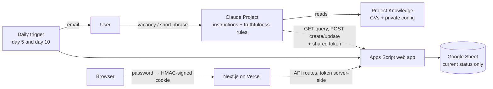
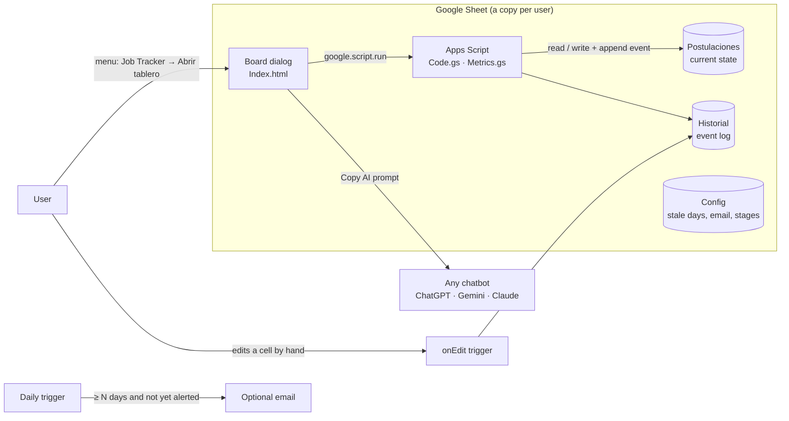
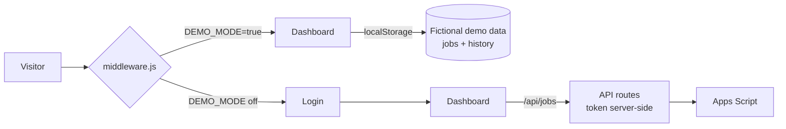

# Architecture

## v1: personal copilot (used during a real job search)

- The model never holds the tracker's state; it queries the Sheet before every write.
- The token lives in two places only: the private knowledge file and Vercel's environment variables. The browser never sees it: the dashboard's API routes act as a proxy, and `middleware.js` guards every route with a signed session cookie.

## v2: open template (this repo's main product)

- **No API, no token.** The board runs inside the Sheet as a dialog, under the owner's own Google account. The optional web app (for phones) is deployed as *execute as me* and *access: only me*.
- **Event log first.** Every stage change, from the board or from a manual edit, appends to `Historial`. Metrics are computed from events, not from snapshots.
- **AI is optional and provider-agnostic.** The board builds a prompt with the application's data and the truthfulness rules; the user pastes it into any chatbot. No API keys.

## Next.js demo (portfolio showcase)

One environment variable switches between the public demo (no login, fictional data, API routes disabled) and the private mode the original dashboard used.
