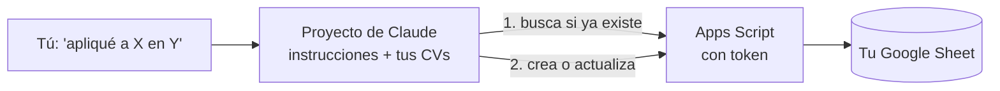

# Modo avanzado: tu tracker conectado a Claude

Esta es la versión que usé en mi propia búsqueda: en vez de llenar el Sheet a mano, le escribía a Claude *"apliqué a Data Analyst en Acme"* y él registraba la postulación en el Sheet, analizaba vacantes, adaptaba mi CV sin inventar nada y me preparaba para cada entrevista.

> **Importante:** esta es la **versión 1**, tal como la usé. Registra la etapa actual de cada postulación pero **no guarda historial**, así que no tiene las métricas, rondas de entrevista ni alertas mejoradas de la [plantilla nueva](../sheets-template/). Combinar las dos cosas (hablarle a Claude y que todo quede en la plantilla nueva) es una idea que dejé documentada pero **no construida**, porque no la he podido probar: ver [docs/ideas.md](../docs/ideas.md#v2--claude-the-chat-workflow-on-top-of-the-new-template).

> **¿Es para ti?** Si solo quieres organizar tus postulaciones, usa la [plantilla de Sheets](../sheets-template/SETUP_GUIDE.es.md): es más fácil y no necesita IA. Este modo es para quien ya usa Claude con plan de pago y se siente cómodo siguiendo pasos técnicos (unos 30 minutos, sin programar).

## Qué hay en esta carpeta

| Archivo | Qué es |
|---|---|
| [`apps-script-v1/Code.gs`](apps-script-v1/Code.gs) | El código que convierte tu Google Sheet en una "API": Claude la llama para buscar, crear y actualizar postulaciones. |
| [`system_prompt.generic.md`](system_prompt.generic.md) | Las instrucciones del Proyecto de Claude, con las reglas para **no inventar experiencia**. Reemplaza lo que está entre `[CORCHETES]`. |
| [`tracker-config.example.txt`](tracker-config.example.txt) | Modelo del archivo privado donde van tu URL y tu token. |
| [`how-it-worked.md`](how-it-worked.md) | Explicación técnica en inglés: arquitectura, qué funcionó y qué cambiaría. |

## Cómo funciona



1. Le escribes una frase corta a Claude.
2. Claude **primero consulta el Sheet** para ver si esa postulación ya existe (nunca confía en su memoria).
3. Si existe, te muestra el registro y confirma qué cambiar. Si no, la crea.
4. Vuelve a leer el Sheet para confirmar que quedó guardado.

## Paso a paso

### 1. Crea el Sheet

1. Crea una hoja nueva en Google Sheets.
2. Cambia el nombre de la primera pestaña a `Tracker` (exactamente así).
3. Pega estos encabezados en la fila 1, uno por columna (cópialos tal cual):

```
Job ID	Company	Position	Job URL	Source	Salary	Recruiter	Recruiter Contact	Match %	Best CV	CV Adapted	Status	Interview Stage	Application Date	Next Step	Last Update	Notes
```

4. Copia el **ID del Sheet**: es la parte de la URL entre `/d/` y `/edit`.

### 2. Pega el código

1. En el Sheet: **Extensiones → Apps Script**.
2. Borra lo que aparece y pega todo el contenido de [`apps-script-v1/Code.gs`](apps-script-v1/Code.gs).
3. Reemplaza `PON_AQUI_EL_ID_DE_TU_GOOGLE_SHEET` por el ID del paso anterior.
4. Engranaje ⚙️ (**Configuración del proyecto**) → **Propiedades de la secuencia de comandos** → agrega:
   - `TRACKER_TOKEN`: una contraseña larga y aleatoria que inventes (por ejemplo, generada con un gestor de contraseñas). Es lo único que impide que otra persona escriba en tu Sheet.
   - `ALERT_EMAIL`: tu correo, si quieres recibir avisos de postulaciones sin movimiento.
5. Arriba, elige la función `createDailyTrigger` y pulsa **Ejecutar** ▶ una sola vez. Acepta los permisos (verás la pantalla de "app no verificada", igual que en la [guía de la plantilla](../sheets-template/SETUP_GUIDE.es.md#google-no-verificó-esta-app-qué-es-y-por-qué-puedes-continuar)).

### 3. Publícalo como web app

1. **Implementar → Nueva implementación → Aplicación web**.
2. **Ejecutar como: Yo**. **Quién tiene acceso: Cualquier usuario**. Tiene que ser así para que Claude pueda llamarla; el token es lo que la protege.
3. **Implementar** y copia la URL (termina en `/exec`).

### 4. Crea el Proyecto en Claude

1. En claude.ai crea un **Proyecto** nuevo.
2. En **Instrucciones** pega el contenido de [`system_prompt.generic.md`](system_prompt.generic.md) (lo que está dentro del bloque de código) y reemplaza los `[CORCHETES]` con tus roles objetivo, tu estilo, etc.
3. En **Conocimiento del proyecto** sube:
   - Tus CVs (una o varias versiones).
   - Una copia de [`tracker-config.example.txt`](tracker-config.example.txt) con **tu** URL y **tu** token.
4. Claude llama al Sheet ejecutando código, así que en la configuración de Claude debe estar activada la **ejecución de código con acceso a internet**, con permiso para `script.google.com` y `script.googleusercontent.com`.

### 5. Prueba

Escríbele: *"apliqué hoy a Analista de Prueba en Empresa Demo, link https://example.com"*. Debe consultar el Sheet, no encontrar nada y crear la fila `JOB-0001`. Revisa el Sheet antes de usarlo con vacantes reales.

Frases que entiende: *"analiza esta vacante"*, *"adapta el CV"*, *"apliqué"*, *"me contactaron"*, *"tengo entrevista"*, *"me rechazaron"*, *"me retiré"*, *"me hicieron una oferta"*.

## Seguridad (léelo)

- **Tu URL y tu token son como una llave** de tu Sheet. No los publiques, no los subas a GitHub y no los compartas en capturas.
- Si crees que se filtraron: cambia `TRACKER_TOKEN` en las propiedades del script y actualiza el archivo en Claude.
- **Cuando termines tu búsqueda, apágalo:** **Implementar → Gestionar implementaciones → Archivar**. Tu Sheet queda intacto; solo deja de existir la URL.

## Limitaciones conocidas

- Solo guarda la etapa actual, no el historial, así que no calcula tiempo por etapa. La [plantilla nueva](../sheets-template/) sí lo hace (y explico la lección en [lessons-learned.md](../docs/lessons-learned.md)).
- Apps Script responde con una redirección, y a veces la escritura se guarda aunque Claude vea un error. Por eso las instrucciones le exigen **volver a consultar antes de reintentar**, para no duplicar filas.
- Solo lo usé con Claude. Otros asistentes que puedan hacer peticiones web podrían usarlo, pero no lo probé.
