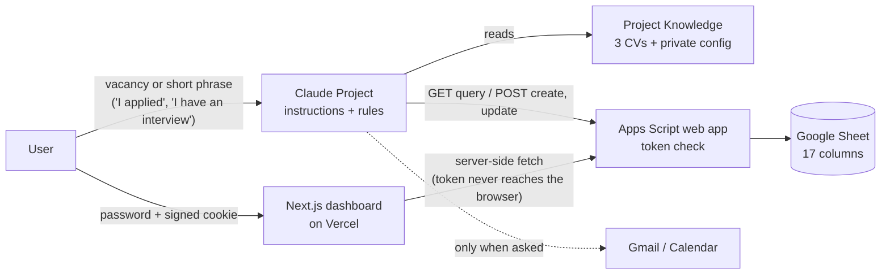

# How the original copilot worked (v1, "advanced mode")

Before the free template, this project was a personal system used during one real remote job search. It is documented here because it is the more interesting engineering story, and because some people may want to rebuild it with their own AI assistant.

> No real URLs, tokens, CVs or application data are included in this repo.

## The pieces

| Component | What it was | Why |
|---|---|---|
| Claude Project | Fixed instructions ([generic version](system_prompt.generic.md)) | Role, truthfulness rules, output formats |
| Project Knowledge | Three CV variants + a private config file with the endpoint and token | The only source for anything claimed about the candidate |
| Apps Script web app | `doGet` (query, get, list) and `doPost` (create, update) over one Sheet, protected by a shared token | Let the assistant read and write the tracker from chat |
| Google Sheet | 17 columns: Job ID, Company, Position, Job URL, Source, Salary, Recruiter, Recruiter Contact, Match %, Best CV, CV Adapted, Status, Interview Stage, Application Date, Next Step, Last Update, Notes | Single source of truth for every application |
| Daily trigger | Emailed a reminder when an application hit exactly 5 or 10 days without updates | Follow-ups |
| Next.js dashboard | Kanban + metrics, password login, API routes as a proxy | A visual pipeline the chat could not give |

The original Apps Script is kept in [`apps-script-v1/Code.gs`](apps-script-v1/Code.gs) (placeholders only) for reference.

## A typical turn

1. The user pastes a vacancy: *"Analyze this vacancy"*. The copilot answers with `MATCH / BEST CV / WHY / MAIN GAPS / VACANCY QUALITY / RECOMMENDATION`.
2. *"Adapt the CV"*: it edits content only, keeps the locked format, and lists every change for approval.
3. The user applies on their own and says *"I applied to X at Y"*.
4. The copilot queries the tracker first (`GET action=query`), shows any match, and only then creates (`POST action=create`) or updates the record. The script, not the model, assigns the Job ID.
5. It reads the record back to confirm the write.

## What worked

- **Truthfulness rules beat ATS scores.** Explicitly forbidding invented experience, and making the model verify every adapted CV against the source documents, produced CVs that held up in interviews.
- **The Sheet as the only source of truth.** The model's memory is not a database. Querying before every write avoided duplicates across chats.
- **Verify before retrying.** Apps Script web apps reply with a 302 redirect and the write can land before the redirect resolves. A non-JSON response does not mean the write failed; re-query before trying again, or you get duplicate rows.
- **Token only on the server.** The dashboard's API routes hold the token; the browser only sees a signed session cookie.

## What did not (and what v2 fixes)

| v1 problem | Consequence | v2 fix (the template) |
|---|---|---|
| Only the current status was stored | Impossible to measure time per stage or where applications stall | `Historial` event log: one row per stage change or note |
| Alerts fired only on day 5 or day 10 exactly | If the trigger failed that day, the alert was lost | "≥ N days and not yet alerted", with an `Alerta enviada` column that resets on every stage change |
| Response rate counted everything not in `Applied` | `Saved` and `Withdrawn` inflated the number | Explicit denominator and numerator, see [docs/metrics.md](../docs/metrics.md) |
| Duplicates detected by company + position text only | Same job with slightly different titles slipped through | Also compares the normalized job link |
| Public web app with a shared token | A leaked token means anyone can write to the Sheet | The template runs inside the Sheet; the optional web app is "only me" |
| Required an AI subscription | Not usable by most people | The template works with no AI at all; prompts are optional and work in any chatbot |

## Rebuilding it yourself

If you want the chat-driven version:

1. Deploy [`apps-script-v1/Code.gs`](apps-script-v1/Code.gs) bound to a Sheet, set `TRACKER_TOKEN` in Script Properties, and deploy as a web app.
2. Put the web app URL and token in a **private** file in your assistant's knowledge (never in a repo).
3. Use [system_prompt.generic.md](system_prompt.generic.md) as the instructions.

Know the trade-off: anyone with that URL and token can write to your Sheet. Rotate the token if it ever leaks, and archive the deployment when you stop using it.
